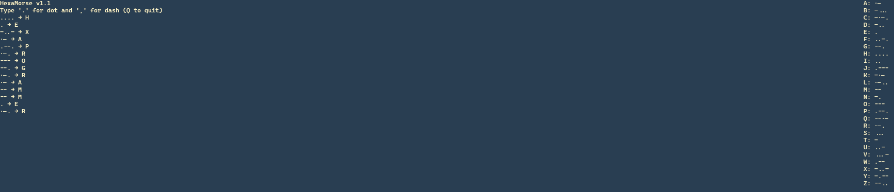

 ```
 __    __                               __       __                                         
|  \  |  \                             |  \     /  \                                        
| $$  | $$  ______   __    __  ______  | $$\   /  $$  ______    ______    _______   ______  
| $$__| $$ /      \ |  \  /  \|      \ | $$$\ /  $$$ /      \  /      \  /       \ /      \ 
| $$    $$|  $$$$$$\ \$$\/  $$ \$$$$$$\| $$$$\  $$$$|  $$$$$$\|  $$$$$$\|  $$$$$$$|  $$$$$$\
| $$$$$$$$| $$    $$  >$$  $$ /      $$| $$\$$ $$ $$| $$  | $$| $$   \$$ \$$    \ | $$    $$
| $$  | $$| $$$$$$$$ /  $$$$\|  $$$$$$$| $$ \$$$| $$| $$__/ $$| $$       _\$$$$$$\| $$$$$$$$
| $$  | $$ \$$     \|  $$ \$$\\$$    $$| $$  \$ | $$ \$$    $$| $$      |       $$ \$$     \
 \$$   \$$  \$$$$$$$ \$$   \$$ \$$$$$$$ \$$      \$$  \$$$$$$  \$$       \$$$$$$$   \$$$$$$$
```                                                                                         
                                                                                            

HexaMorse is a **terminal-based Morse code typing tool** with a real-time cheatsheet. Type dots and dashes, and it decodes your Morse input instantly. Perfect for practicing Morse, playing around, or just showing off to your friends.  

---

## Features

- Interactive cheatsheet always visible on the right side.
- Keeps a scrollable history of all typed Morse symbols.
- Cross platform (tested on Linux/Arch with curses).

---

## Morse Code Input

- `.` → Dot  
- `,` → Dash  
- `Q` → Quit the program  

Example:  


--- → S


---

## Screenshots


HexaMorse v1.1
Type '.' for dot and ',' for dash (Q to quit)

Current: .-.
.- → A
--. → G
... → S A: .-
B: -...
C: -.-.
...


---

## Installation

Just clone the repo and run:  

```bash
git clone https://github.com/HexaProgrammer/HexaMorse.git
cd HexaMorse
python main.py
```
Even better if u use arch, btw:
```
yay -S hexamorse
```
Dependencies:

Python 3.x

curses (usually included with Python on Linux/macOS)

No root, no virtual environment needed.

Contributing

Feel free to open issues or pull requests!

Suggestions for new features are welcome.

If you fork it, make sure to keep the version updated (v1.x).

License

MIT License
 — use, modify, and share freely.
Note: This project was developed by Hexa Programmer. I used AI to assist with debugging and refining the terminal rendering logic.
Made with ❤️ by Hexa-Programmer
Keep tapping those dots and dashes 💀
